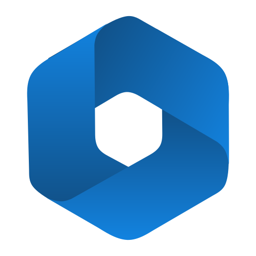

<div>
    <p align="center">
        
    </p>
    <h1 align="center">Peninsula Portal</h1>
    <p align="center">A toolbox of all apps developed by 6036</p>
</div>

## Table of Contents
- [Getting Started](#getting-started)
    - [Releases](#releases)
    - [Development](#development)
- [Peninsula Panel](#peninsula-panel)
    - [Capabilities](#capabilities)
    - [Pages and Tools](#pages-and-tools)
    - [Getting Started](#getting-started-1)
- [Peninsula Planner](#peninsula-planner)
    - [Capabilities](#capabilities-1)
    - [Getting Started](#getting-started-2)
- Peninsula Perception - <kbd>TBD</kbd>
- [Peninsula Presets](#peninsula-presets)
- [Resources](#resources)

## Getting Started

### Releases
Check the releases for different packages.  
MacOS (Darwin) requires running a few more commands to authorize the application - otherwise application will be marked as "damaged."
1. `cd` to the directory containing the application
2. `xattr -cr Peninsula.app`

### Development

### Setup
- [Install NPM / Node](https://docs.npmjs.com/downloading-and-installing-node-js-and-npm)
- Navigate to the project directory within terminal
```shell
npm install
```

### Start
```shell
npm start
```

### Packaging
```shell
npm run package
```
This should create a `./build` directory with the packaged apps. Check with `package.js` to see the build options.

<div>
    <h1 id="peninsula-panel" align="center">Peninsula Panel</h1>
    <p align="center">A networktables viewing software for a visual debugging process</p>
</div>

## Capabilities
- Connection to specified ip with port `5810` with NT4
- Paneled visualization of NetworkTable values
    - Table/Topic browsing
    - Graphing of numerical and discrete topics
    - Odometry 2D/3D displaying

## Pages and Tools

### Add Page
Your home page, where you can pick what page to add, including any of the pages listed below. Includes searching for quick access to wanted tables, topics, and tools.

### Browser Page
Views any table or topic, similar to your operating system's file explorer.

### Graph Page
Graphs numerical and discrete topics in NT. Choose window view, in `ms`, of the graph to see. Pick colors for different variables.

### Odometry 2D Page
Displays the robot as shown from `double[3]`, `float[3]`, and `int[3]` in NT. Choose field template, set your own, and change units. Pick colors for different poses, including toggling ghost effect and render type.

### Odometry 3D Page
Displays the robot as shown from `double[7]`, `float[7]`, and `int[7]` in NT. Choose field template, or use axis, and change units. Pick colors for different poses, including toggling ghost effect, render type, and solid color display.

## Getting Started

### FAQ
> How can I graph topics in the Graph, Odometry 2D, or Odometry 3D?

Drag topics from the left or from the Browser to the axis you want for Graph, or into the pose section for Odometry 2D and 3D.

> How can I change the color, or display type of topics being graphed or displayed in Graph, Odometry 2D, or Odometry 3d?

Click on them to open a more extensive menu of the options available to you. Clicking on the eye can also hide the topic if needed.

### Development

<div>
    <h1 id="peninsula-planner" align="center">Peninsula Planner</h1>
    <p align="center">A path planning software which provides a visual way to edit and create paths</p>
</div>

## Capabilities
- Secure project creation and management system
- Visual editing process
    - Sleek and streamline editing process of objects
    - Dynamic multi-path creation system with repeat-node support
- Playback feature for trajectory generation

## Getting Started

### FAQ
> How can I reset the divider to it's original position?  

On the view menu of the app, click "Reset divider."

> How can I delete nodes when creating or editing a path?  

When clicking a node, hold down <kbd>shift</kbd> to remove it instead.

> How can I select multiple nodes or obstacles at once?

By dragging on the display area, you can create a rectangular seletion. This allows you to select multiple objects at once. Additionally, holding down <kbd>shift</kbd> while clicking adds or removes objects to your selection.

### Development
This program does not generate the trajectory by itself. It relies on a python file, which you can change, to generate the path.
Here is what the python script should expect as input and what it should output:  
`data.in`
```json
{
   "config": {
       "map_w": 0, "map_h": 0,
       "side_length": 0,
       "mass": 0,
       "moment_of_inertia": 0,
       "efficiency_percent": 0,
       "12_motor_mode": false
   },
   "nodes": [
       {
           "x": 0, "y": 0,
           "vx": 0, "vy": 0,
           "vt": 0,
           "theta": 0
       }
   ],
   "obstacles": [
       {
           "x": 0, "y": 0,
           "radius": 0
       }
   ]
}
```
`data.out`
```json
{
   "dt": 0,
   "state": [
       {
           "x": 0, "y": 0,
           "vx": 0, "vy": 0,
           "theta": 0
       }
   ]
}
```
`vx`, `vy`, `vt`, and `theta` of `data.in` can be `null` to ignore a velocity or angle override. Adjust your script accordingly.

<div>
    <h1 id="peninsula-presets" align="center">Peninsula Presets</h1>
    <p align="center">Settings for Peninsula Portal</p>
</div>

## Application Data

### Application Data Directory
The location where any data stored within the application is located on the computer.
- Windows: `%APPDATA%`
- MacOS: `~/Library/Application Support/`
- Linux: `$XDG_CONFIG_HOME` or `~/.config`  

More information can be found on [Electron's documentation](https://www.electronjs.org/docs/latest/api/app#appgetpathname).

### Application Log Directory
The location where any logs are stored for the application, a subset of the app data directory called `./logs`.

### Database Host URL
The url of which is fetched to obtain globalized data for the application, such as templates, configurations, images, and models. The structure of the database is as follows:
```js
| config.json // contains redirect url + holiday
| templates.json // for ./templates dir
| robots.json // for ./robots dir
+ templates
| | <name>.png
| | <name>.glb
+ robots
| | <name>.glb
+ <feature-name> // different for each feature
| ...
```
Repolling the database will pull what it needs from this database, though it might take some time to finish polling `.glb`s.

### Competition Mode
Toggling competition mode on disables polling of database, if constant repolling or rewriting of existing files causes lag.

## Appearance

### Holiday
The current application holiday!

<div>
    <h1 id="resources" align="center">Resources</h1>
</div>

- [Electron](https://www.electronjs.org/) - Window display and management
- [Fuse.js](https://www.fusejs.io/) - Fuzzy search
- [Highlight.js](https://highlightjs.org/) - Syntax coloring for code blocks in `.md`
- [Ionicons](https://ionic.io/ionicons) - App icons
- [Showdown.js](https://showdownjs.com/) - `.md` to `HTML`
- [Three.js](https://threejs.org/) - 3D rendering
