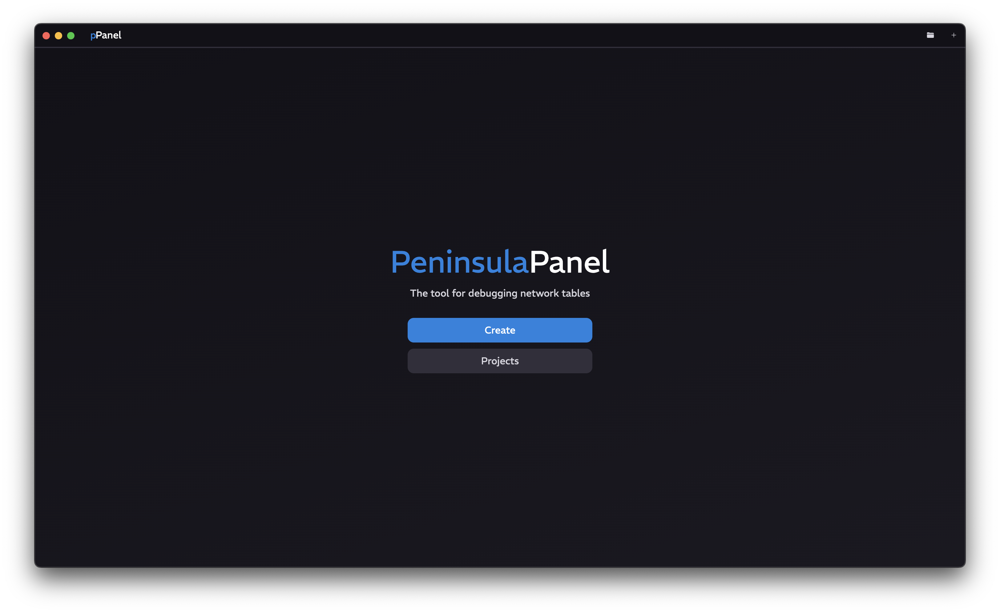
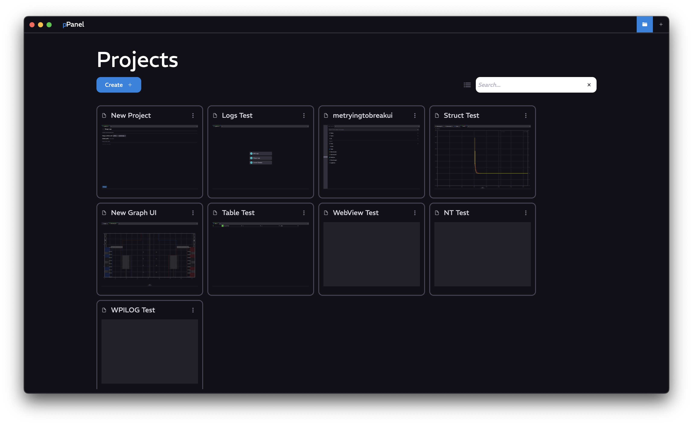
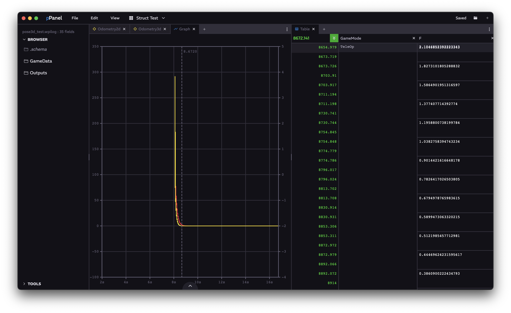

<a href="../../README.md" class="back">← Back</a>

    <h1 id="peninsula-panel" align="center">Peninsula Panel</h1>
    
A networktables viewing software for a visual debugging process

## Capabilities
- Connection to specified ip with port `5810` with NT4
- Paneled visualization of NetworkTable values
    - Table/Topic browsing
    - Graphing of numerical and discrete topics
    - Odometry 2D/3D displaying

## [FAQ](./FAQ.md)

## Tabs

### Basic Tabs
[Add Tab →](./tabs/ADD.md)

[Browser Tab →](./tabs/BROWSER.md)

### Numerical Analysis Tabs
[Graph Tab →](./tabs/GRAPH.md)

[Table Tab →](./tabs/TABLE.md)

### Odometry Tabs
[Odometry 2D Tab →](./tabs/ODOMETRY2D.md)

[Odometry 3D Tab →](./tabs/ODOMETRY3D.md)

### External Tooling Tabs
[WebView Tab →](./tabs/WEBVIEW.md)

[Logger Tab →](./tabs/LOGGER.md) *SEE BOTTOM

[LogWorks Tab →](./tabs/LOGWORKS.md)

## Navigation

### Title Page

Click on <kbd>Create</kbd> to create a new project, or click on <kbd>Projects</kbd> to open the list of projects

### Projects Page

Click on <kbd>Create</kbd> to create a new project. Double-clicking a project opens that project. Single clicking a project selects or unselects it. Right-clicking anywhere to open the context menu allows for editing of the selected projects. To switch between list display and grid display, simply click the list or grid icon next to the search bar.

### Project Page

#### Title Bar Navigation
Clicking the logo will return you to the Title Page. Clicking any of the File, Edit, and View menus will open up a menu similar to the application's native File, Edit, and View menus. Clicking on the project name will open up a menu allowing you to edit the project name, save / copy / delete this project, switch the log source mode, and toggle connections for NetworkTables or import the WPILOG. Furthermore, on the right, you can save the project open the Projects page, or create a new project.

#### Side Bar
Similar to the [Browser](./tabs/BROWSER.md), it lists the current topics and tables. It also has a submenu for quickly dragging in tools. These topics can also be dragged into a Panel, which can add a [Browser](./tabs/BROWSER.md) tab.

#### Panels
The entire project consists of movable and draggable panels, each having multiple tabs. To resize them, simply drag the dividers between them. To add a tab, click the <kbd>+</kbd>. To access more features of the Panel, simply click on the <kbd>...</kbd> located in the top-right corner.

> \* The Logger tab requires a database. The public database is hosted on [Repl](https://replit.com/~) and is **PUBLIC**, so the Logger is disabled. If you want to set up a database, contact me
