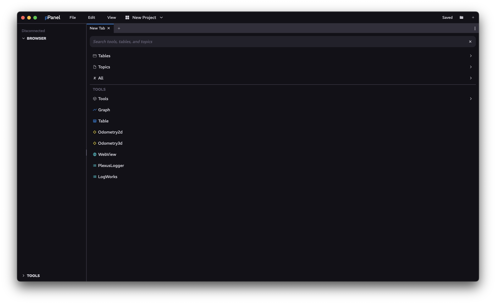

<a href="../MAIN.md" class="back">← Back</a>

# Add Tab

Your main tab, where you can pick what tab to add. Includes searching for quick access to wanted tables, topics, and tools.

## Navigation

### Top Search Bar
Type your search query, such as a topic or a table name, or a name of a tool. Clicking the <kbd>x</kbd> clears the search query.

### Tables Filter
Clicking on this allows you to search only tables from the Top Search Bar.  Clicking <kbd>delete</kbd> on the Top Search Bar when it is empty or clicking the <kbd>x</kbd> clears this filter.

### Topics Filter
Clicking on this allows you to search only topics from the Top Search Bar.  Clicking <kbd>delete</kbd> on the Top Search Bar when it is empty or clicking the <kbd>x</kbd> clears this filter.

### Topics and Tables Filter
Clicking on this allows you to search both topics and tables from the Top Search Bar. Clicking <kbd>delete</kbd> on the Top Search Bar when it is empty or clicking the <kbd>x</kbd> clears this filter.

### Tools Filter
Clicking on this allows you to search tools from the Top Search Bar. Clicking <kbd>delete</kbd> on the Top Search Bar when it is empty or clicking the <kbd>x</kbd> clears this filter.

### Tools
A list of all available tools in Panel
