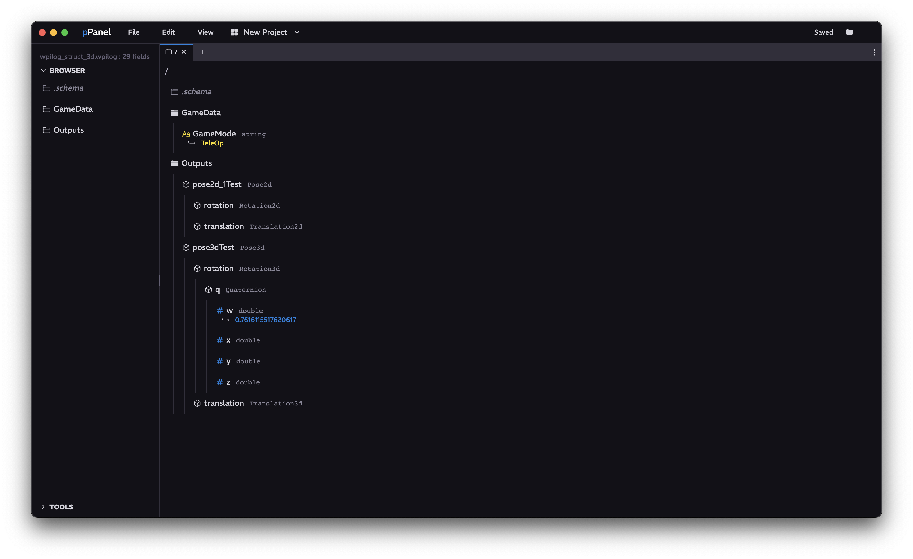

<a href="../MAIN.md">← Back</a>

# Browser Tab

Views any table or topic, similar to your operating system's file explorer.

## Navigation

### Top Navigation Bar
Consists of the path to your topic. Clicking on different parts of the path can take you to different parent tables. Clicking on the <kbd><</kbd> brings you up one table.

### Browser Body
Click on tables (folder icons) to open them. Click on them again, or click the side line to close them. Click on Structures (object icons) to open them as well. Clicking on any primitive topic will show the current value at the current timestamp.  

Dragging is available from the browser body, allowing you to drag these topics or tables to wherever.
