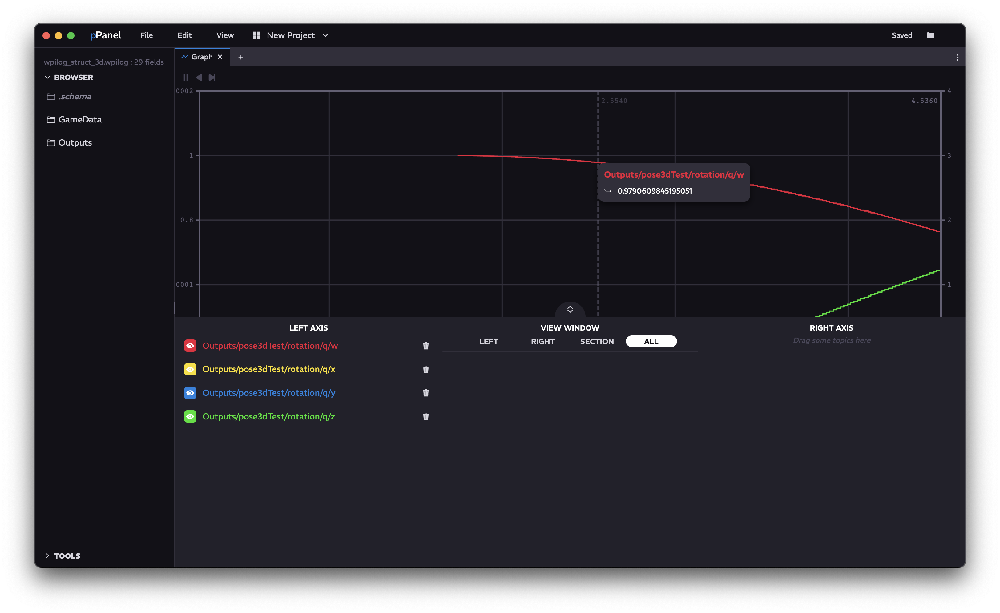

<a href="../MAIN.md" class="back">← Back</a>

# Graph Tab

Graphs numerical and discrete fields from the log source. Includes range selection along any point of the graph.

## Navigation

### Main Display
Shows graph of fields between wanted timestamps. Hovering over a line will show the value of the line at that timestamp. If multiple lines intersect, clicking <kbd>tab</kbd> will toggle between overlapping data points. Additionally, also shows the current hovering timestamp and the global project timestamp within the log source. Clicking anywhere on the graph will set the project timestamp within the log source to the hovered timestamp. Scrolling here will zoom in or out on the graph about the hovered timestamp.

### Display Navigation
Pause / Play - pauses / plays project timestamp  
Skip Back - jumps project timestamp to minimum timestamp available  
Skip Forward - jumps project timestamp to maximum timestamp available  

### Options Menu (bottom)

Clicking the bottom thumb or dragging the bottom thumb upwards will open the menu partially. Dragging the thumb fully upwards will enable fullscreen browsing of the option menu. Clicking the thumb again will close it.

#### Left Axis
Drag topics from the sidebar or the [Browser](../tabs/BROWSER.md) into this area to start graphing them. Clicking on a topic shows a more extensive menu with color selection. Clicking the eye will toggle the visibility of the line, and clicking the <kbd>x</kbd> icon will remove this topic from the graph.

#### View Window

##### All
Views the entire log from the minimum timestamp to the maximum timestamp.

##### Section
Views a section of the log, depending on user inputs (`ms`)

##### Right
Views the right end of the log, from timestamps `Mx-t` to `Mx` where `Mx` is the maximum timestamp and `t` is the backwards view time.

##### Left
Views the left end of the log, from timestamps `Mn` to `Mn+t` where `Mn` is the minimum timestamp and `t` is the forwards view time.

#### Right Axis
See [Left Axis](#left-axis)
