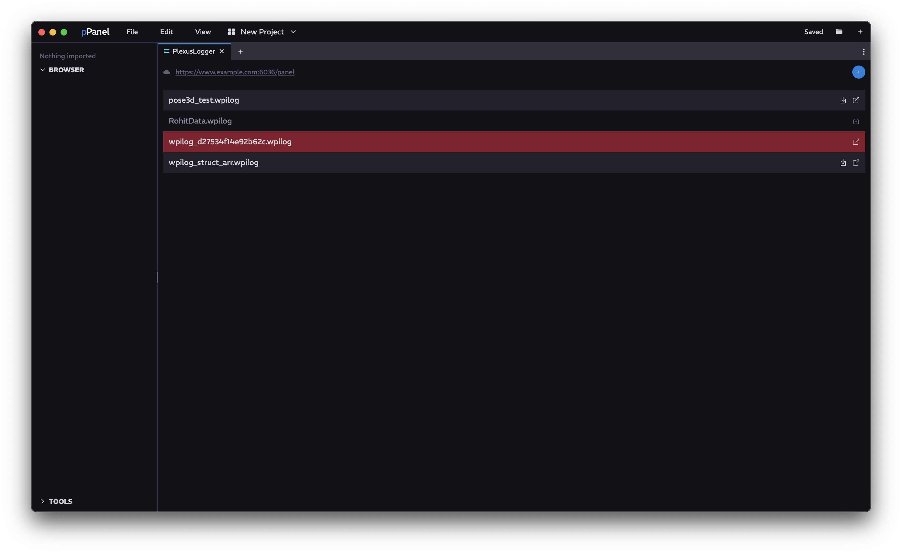

<a href="../MAIN.md">← Back</a>

# Logger Tab

Cloud logging system for instant and community sharing of logs for nearly instantaneous debugging.

## Navigation

### Top Status Bar
Should show current state of Logger's server connection. Clicking on the server address opens the url. Clicking the <kbd>+</kbd> button will allow you to select a file to add.

### Main Log List
Lists available logs on the server and on your client. To download logs from the server, click the download button on the listed log. To open the log, click the open button on the listed log. For a more extensive menu, right click the listed log to open the menu.  
Listed logs have a few states.

| State | Meaning | Appearance |
| - | - | - |
| `default` | Exists on the server, not downloaded | Only has download button |
| `downloaded` | Exists on the server, downloaded | Has download and open button |
| `deleted` | Doesn't exist on the server, downloaded | Only has open button, red |
