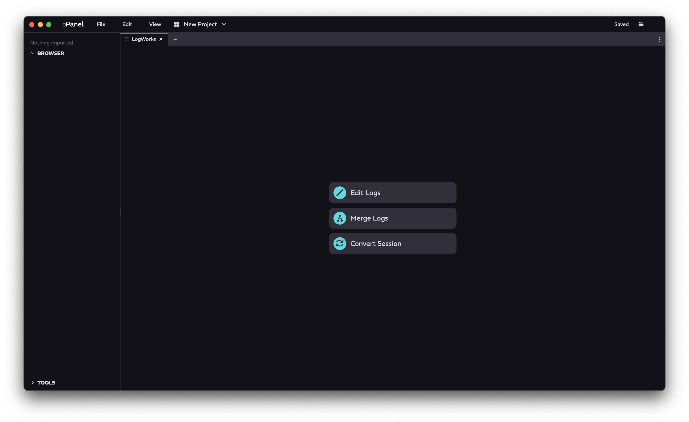

<a href="../MAIN.md">← Back</a>

# LogWorks Tab

Log file actions, including editing, merging, and converting logs.

## Navigation

### Edit Logs
Not yet implemented

### Merge Logs

The ability to merge selected logs into a singular log.

#### Merge Configuration
Settings for how to merge logs

| Name | Usage |
| - | - |
| Conflict Affix | Prefix or suffix conflict resolution |
| Conflict Count | How duplicates are counted. This includes numerically, hexadecimally, and alphabetically (base 26) |
| Global Prefix | A global prefix applied to all topics |

#### Logs
List of logs to merge. Drag and drop them in from your OS.

#### Merging
You will be asked for a save location. You can provide any file extension you want, but a blank extension will result in the automatic appending of `.wpilog` as the extension.
