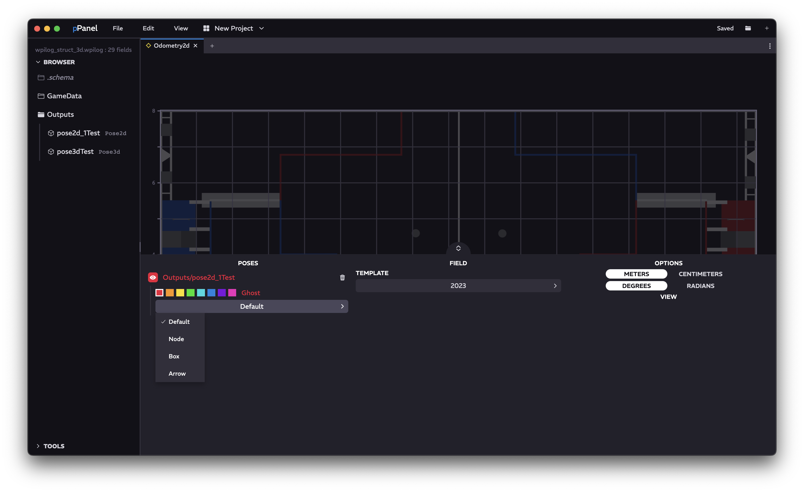

<a href="../MAIN.md">← Back</a>

# Odometry 2D Tab

Displays parsable poses located within the log, including additional debug features.

## Navigation

### Main Display
Shows the robot on the field with origin bottom-left.

### Display Navigation
Play bar - drag (like YouTube) to the wanted playback location. This will modify the global timestamp.  
Pause / Play - pauses / plays project timestamp  
Skip Back - jumps project timestamp to minimum timestamp available  
Skip Forward - jumps project timestamp to maximum timestamp available  

### Options Menu (bottom)

Clicking the bottom thumb or dragging the bottom thumb upwards will open the menu partially. Dragging the thumb fully upwards will enable fullscreen browsing of the option menu. Clicking the thumb again will close it.

#### Poses
Drag topics from the sidebar or the [Browser](../tabs/BROWSER.md) into this area to start graphing them. Clicking on a topic shows a more extensive menu with color selection and display type. Additionally, you can toggling the ghost effect of the pose. Clicking the eye will toggle the visibility of the line, and clicking the trash icon will remove this topic from the field.  

Available Display Types:
- Default (Dot + Border)
- Node (Dot)
- Box (Border)
- Arrow

Available Displayable Topic Types:
- `double[3]`
- `float[3]`
- `int[3]`
- `Pose2d`

#### Field
Select the wanted field template from the menu, or select a blank field to customize the size.

#### Options
Change the units. Self explanatory.
