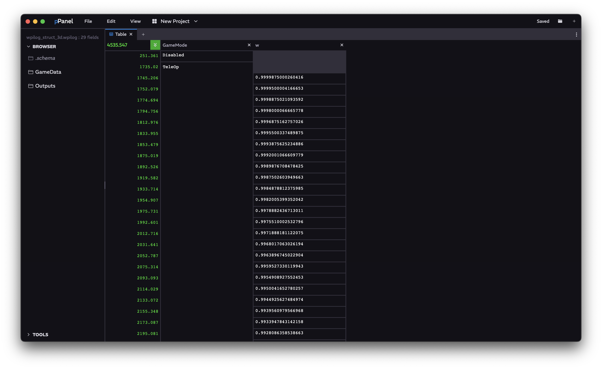

<a href="../MAIN.md">← Back</a>

# Table Tab

Displays any value from source. Search timestamp or follow the current playback. Drag topics in to see them.

## Navigation

### Timestamp Navigator
With the "follow" button activated, this timestamp matches the global project timestamp. Entering a number here will also modify the global timestamp. With the "follow" button deactivated, this timestamp can be whichever. Entering a number will jump the table to the wanted timestamp.

### Topics

#### Header
Hovering over the column header will show the full topic path. Clicking the <kbd>x</kbd> will remove the topic. These topics are draggable, and can be moved to a [Graph](../tabs/GRAPH.md) or moved around within the Table.

#### Column Data
Shows the data within this topic. Self explanatory.
