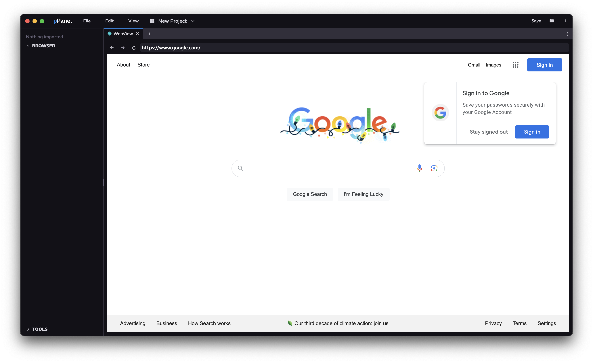

<a href="../MAIN.md">← Back</a>

# WebView Tab

Displays a website. Works like any browser.

## Navigation

### Top Navigation Bar
Back button - works like Chrome back button  
Forward button - works like Chrome forward button  
Refresh button - works like Chrome refresh button  
URL Input - works like Chrome URL input without the auto-suggestions

### Body
Page content
