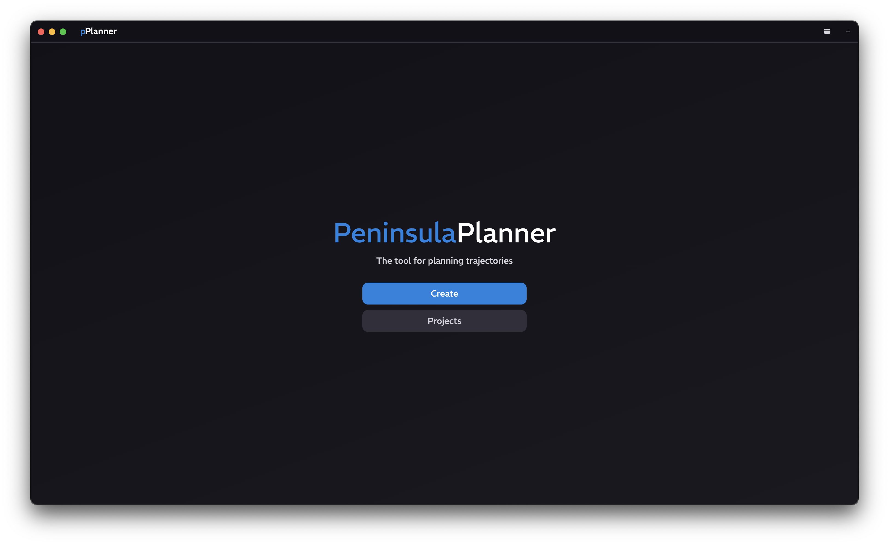
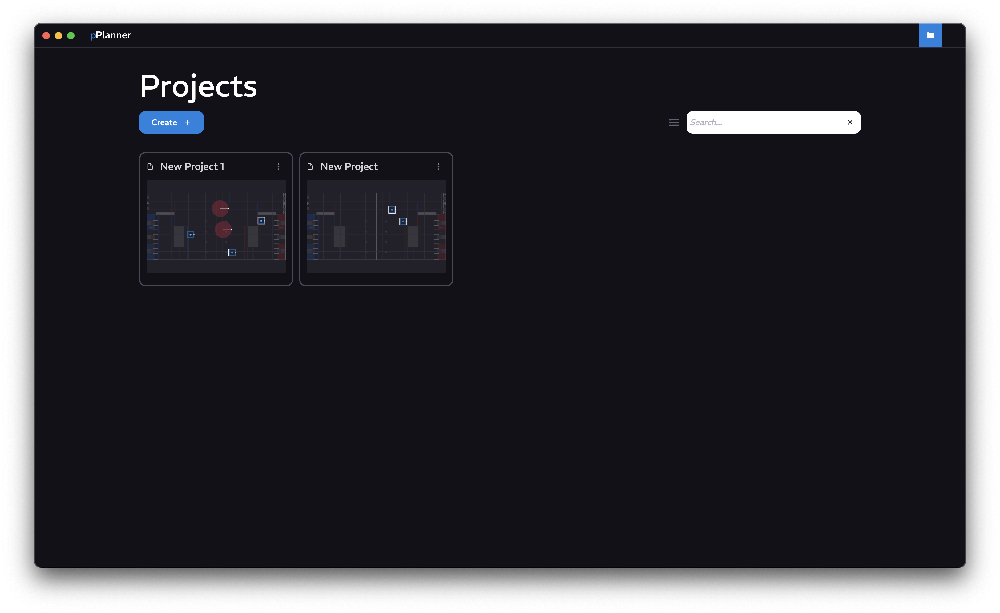
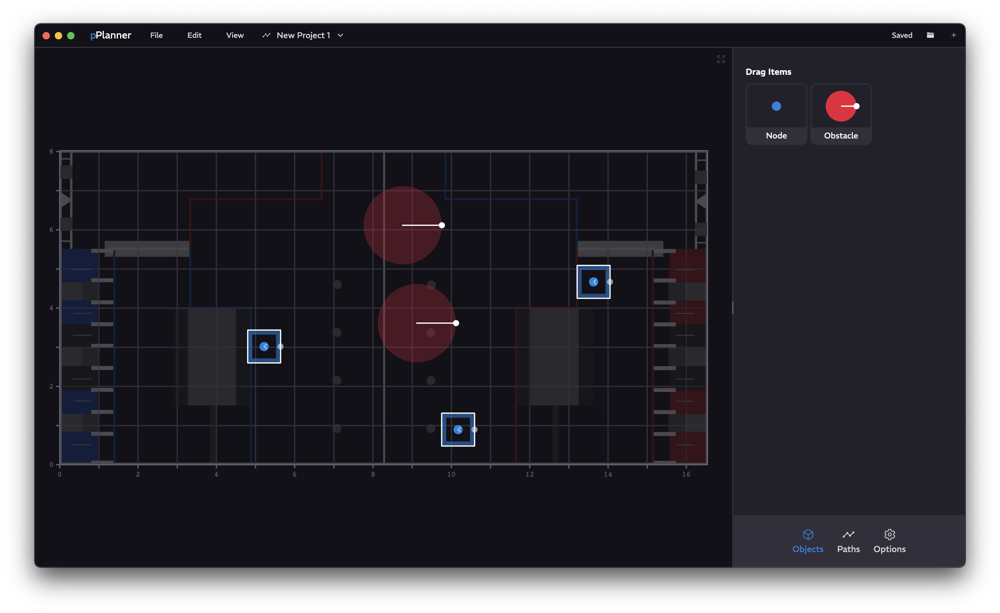

<a href="../../README.md" class="back">← Back</a>

<div>
    <h1 id="peninsula-planner" align="center">Peninsula Planner</h1>
    <p align="center">A path planning software which provides a visual way to edit and create paths</p>
</div>

## Capabilities
- Secure project creation and management system
- Visual editing process
    - Sleek and streamline editing process of objects
    - Dynamic multi-path creation system with repeat-node support
- Playback feature for trajectory generation

## [FAQ](./FAQ.md)

## Navigation

### Title Page

Click on <kbd>Create</kbd> to create a new project, or click on <kbd>Projects</kbd> to open the list of projects

### Projects Page
<br>
Click on <kbd>Create</kbd> to create a new project. Additionally, you can select a template to create a project from. Double-clicking a project opens that project. Single clicking a project selects or unselects it. Right-clicking anywhere to open the context menu allows for editing of the selected projects. To switch between list display and grid display, simply click the list or grid icon next to the search bar.

### Project Page


#### Title Bar Navigation
Clicking the logo will return you to the Title Page. Clicking any of the File, Edit, and View menus will open up a menu similar to the application's native File, Edit, and View menus. Clicking on the project name will open up a menu allowing you to edit the project name or save / copy / delete this project. Furthermore, on the right, you can save the project open the Projects page, or create a new project.

#### Main Display
Displays the active field that this project uses as a template. You can drag, move, and edit nodes from this field. Additionally, the playback menu, similar to YouTube, will also appear here, so you can navigate the generated path your script created. Clicking the fullscreen button in the top-right corner will close the Side Menu, and clicking it again will return the display to the unmaximized state.

#### Side Menu

##### Bottom Navigation
Here is where you can find the available panels split into cohesive sections.

##### Objects Panel
Allows you to edit selected objects or drag in new ones. Potential attributes include position, radius, direction, velocity, and rotational velocity. Direction, velocity and rotational velocity can be disabled such that there is no override. You can also delete selected objects here.

##### Paths Panel
Allows you to create paths or select and edit old paths. Additionally allows you to run the generation script on the selected path.

##### Options Panel
Changing of project settings, such as map size, robot size, and robot mass. Additionally, includes settings for the script, such as moment of inertia, efficiency, and 12-motor mode. You can also select a script path here, or use the default script packaged with the application. Changing of the python script command is also permitted, though beware of loading projects from external sources.

## Development Notes

This program does not generate the trajectory by itself. It relies on a python file, which you can change, to generate the path.
Here is what the python script should expect as input and what it should output:  
`data.in`
```json
{
   "config": {
       "map_w": 0, "map_h": 0,
       "side_length": 0,
       "mass": 0,
       "moment_of_inertia": 0,
       "efficiency_percent": 0,
       "12_motor_mode": false
   },
   "nodes": [
       {
           "x": 0, "y": 0,
           "vx": 0, "vy": 0,
           "vt": 0,
           "theta": 0
       }
   ],
   "obstacles": [
       {
           "x": 0, "y": 0,
           "radius": 0
       }
   ]
}
```
`data.out`
```json
{
   "dt": 0,
   "state": [
       {
           "x": 0, "y": 0,
           "vx": 0, "vy": 0,
           "theta": 0
       }
   ]
}
```
`vx`, `vy`, `vt`, and `theta` of `data.in` can be `null` to ignore a velocity or angle override. Adjust your script accordingly.
